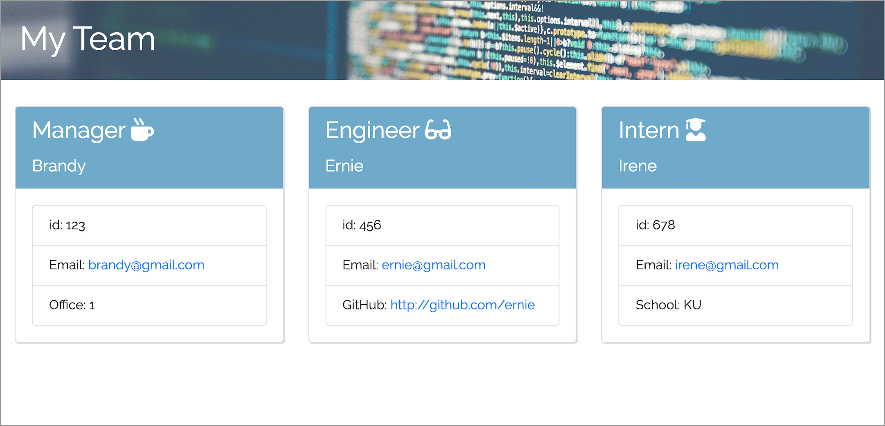
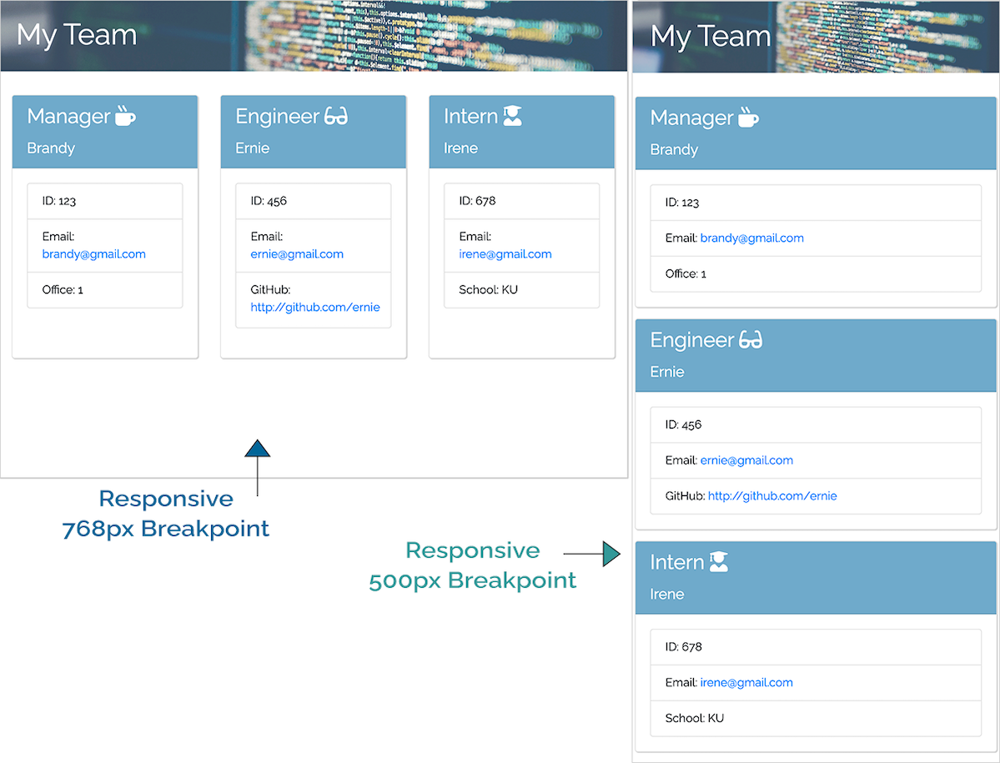

# 10 Object-Oriented Programming: Team Profile Generator

## Table of Contents

- [10 Object-Oriented Programming: Team Profile Generator](#10-object-oriented-programming-team-profile-generator)
  - [Table of Contents](#table-of-contents)
  - [Program Description](#program-description)
  - [URL and Repo Location](#url-and-repo-location)
  - [Installation Instructions](#installation-instructions)
    - [Usage information](#usage-information)
    - [Licenses](#licenses)
    - [Contributing](#contributing)
  - [Tests](#tests)
  - [DEMO](#demo)
  - [Screenshots](#screenshots)
    - [User Story](#user-story)
    - [HTML file dynamically generated with NodeJS CLI](#html-file-dynamically-generated-with-nodejs-cli)
      - [Responsive Design](#responsive-design)
    - [Acceptance Criteria](#acceptance-criteria)
    - [CLI-Meets all Acceptance Criteria](#cli-meets-all-acceptance-criteria)
  - [Questions](#questions)

## Program Description
A Node.js command-line application that takes in information about employees on a software engineering team, then generates an HTML webpage that displays summaries for each person. Inquirer and Jest packages are used.

## URL and Repo Location
The url for the site is: (https://brandyquinlan.github.io/Team_Profile_Generator/)<br>
The repo is located here: (https://github.com/brandyquinlan/Team_Profile_Generator/)

## Installation Instructions
  Run the command "npm i" to install dependencies

### Usage information
  To use the application, run the command "node index.js"

### Licenses
  none

### Contributing
  none

## Tests
```
Employee.test.js
Engineer.test.js
Intern.test.js
Manager.test.js
```
<<<<<<< HEAD

=======

>>>>>>> cc52045f47965fadfa2fc775c8babcd34c89d4d8
## DEMO
* [Link to demo](https://drive.google.com/file/d/1gAw_Z9mYlSkxO-PZpA-X3sgWMqO1pMaK/view?usp=sharing)

## Screenshots

### User Story
```
AS A manager
I WANT to generate a webpage that displays my team's basic info
SO THAT I have quick access to their emails and GitHub profiles
```
### HTML file dynamically generated with NodeJS CLI

#### Responsive Design


### Acceptance Criteria
```
WHEN I start the application
  THEN I am prompted to enter the team manager’s name, employee ID, email address, and office number
WHEN I enter the team manager’s name, employee ID, email address, and office number
  THEN I am presented with a menu with the option to add an engineer or an intern or to finish building my team
WHEN I select the engineer option
  THEN I am prompted to enter the engineer’s name, ID, email, and GitHub username, and I am taken back to the menu
WHEN I select the intern option
  THEN I am prompted to enter the intern’s name, ID, email, and school, and I am taken back to the menu
WHEN I decide to finish building my team
  THEN I exit the application, and the HTML is generated
```
### CLI-Meets all Acceptance Criteria
<<<<<<< HEAD

=======

>>>>>>> 7e312618ff6512467a5fd78b584596f2c6d65c2c

## Questions
Please contact me with questions:
```
Brandy Quinlan
Email: brandyquinlan@gmail.com
Github link: brandyquinlan
```
```
